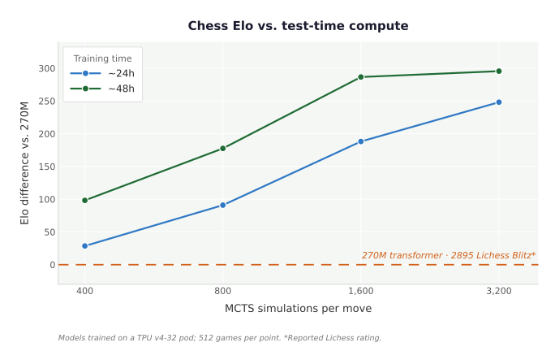

# Desert Snowball test-time scaling



The two released 10-block, 256-channel checkpoints were evaluated against the
same Searchless Chess 270M reference. model34400 was trained in under 24 hours
on a TPU v4-32 pod; model68800 was trained for 48 hours. Each point contains
512 games over 256 openings, with colors reversed for the second game.

| Checkpoint | Search | W-D-L vs 270M | Score | Score Elo (95% CI) | BayesElo |
| --- | ---: | ---: | ---: | ---: | ---: |
| model34400 | 400 | 205-144-163 | 54.1% | +29 (+5 to +53) | +27 |
| model34400 | 800 | 256-131-125 | 62.8% | +91 (+65 to +118) | +90 |
| model34400 | 1,600 | 325-115-72 | 74.7% | +188 (+161 to +217) | +186 |
| model34400 | 3,200 | 359-108-45 | 80.7% | +248 (+219 to +279) | +238 |
| model68800 | 400 | 261-131-120 | 63.8% | +98 (+73 to +125) | +99 |
| model68800 | 800 | 325-103-84 | 73.5% | +178 (+151 to +205) | +177 |
| model68800 | 1,600 | 391-77-44 | 83.9% | +287 (+254 to +323) | +283 |
| model68800 | 3,200 | 398-70-44 | 84.6% | +296 (+261 to +333) | +294 |

Score Elo is the direct logistic transform of game score relative to 270M. Its
95% confidence interval is a deterministic bootstrap over opening pairs, so
the two color-reversed games are resampled together. The BayesElo column is the
tournament output shifted to set 270M to zero. These are opponent-relative
tournament ratings, not human/FIDE Elo. Stockfish 16 was used only for
conservative adjudication.

The checkpoints are available in the
[Desert Snowball release](https://github.com/wtedw/nanoAlphaZero/releases/tag/desert-snowball-1028-checkpoints-v1).

## Reproduce the figure

From the repository root:

```bash
uv run evals/desert-snowball-test-time-scaling/plot.py
```

The script verifies the source PGN and summary hashes in `manifest.toml`,
checks the game counts, failures, colors, opening pairs, and summary W-D-L,
then regenerates `results.csv` and `test-time-scaling.svg`. The source runs are:

- [400 simulations](../tournament-desert-snowball-checkpoints-vs-searchless270m-400sims-512games-per-pair/runs/20260818-121855-0a890a3592)
- [800 simulations](../tournament-desert-snowball-checkpoints-vs-searchless270m-800sims-512games-per-pair/runs/20260818-133743-79abe1e8f5)
- [1,600 and 3,200 simulations](../tournament-desert-snowball-checkpoints-vs-searchless270m-1600-3200sims-512games-per-pair/runs/20260818-184509-0e172eabae)
